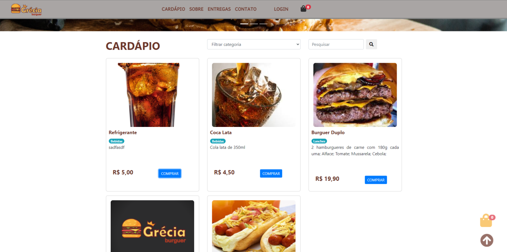
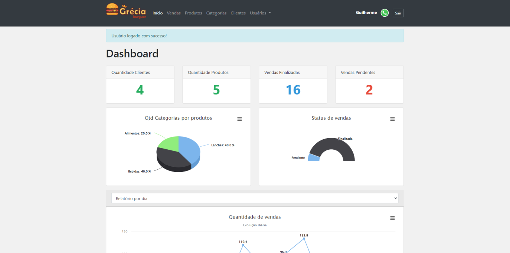
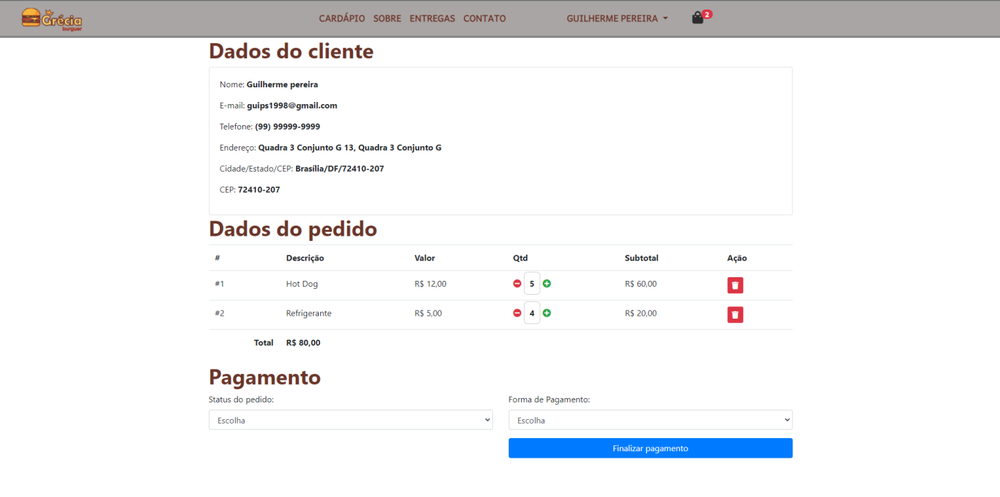
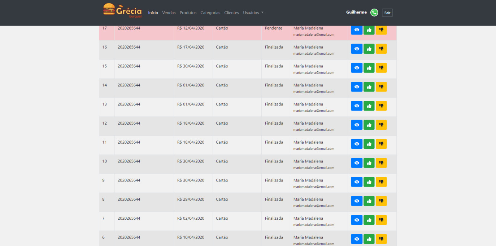

Um sistema de gerenciamento e compra de uma lanchonete, desenvolvido em php.

Tecnologias utilizadas: Php OO, MySql, PDO, Javascript, Html, CSS.

<table>
  <tr>
    <td colspan="2">Site</td>
    <td colspan="2">Administração</td>
  </tr>
  <tr>
    <td></td><td></td>
    <td></td><td></td>
  </tr>
</table>
